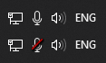

# hyperx-mute-on-taskbar

Show the microphone mute state of a HyperX Cloud Flight headset (and possibly others) on the taskbar.

## How to build

Use the following command to clone the repo with all of its submodules:  
`git clone --recurse-submodules https://github.com/sanraith/hyperx-mute-on-taskbar`

Build `SharpLibHid\Project\SharpLibHid.sln` in `Release` mode.

Build `HyperXMuteTaskbar.sln` in `Release` mode.

## How to use

Run `HyperXMuteTaskbar.exe`. HyperX devices will automatically be discovered.  
If the taskbar icon displays a question mark, press the mute button on the headset to get the initial mute state.

## Attributions

### SharpLibHid

This project uses a fork of the SharpLidHid library. The fork contains minor fixes, so that the library can handle 'unknown' devices.  
Original source is available here: <https://github.com/Slion/SharpLibHid>  
Fork is available here: <https://github.com/sanraith/SharpLibHid>

### Flaticon

Icons designs are created based on images made by [Freepik](http://www.freepik.com/) from [www.flaticon.com](https://www.flaticon.com/).
